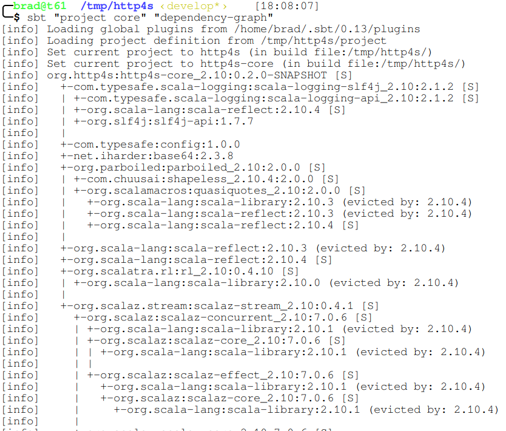

% sbt tips
% <a href="http://bradfritz.net/">Brad Fritz</a>
% July 7th, 2014

# Manual Install

Most OSes have packages now, but if you must...

    curl -O http://repo.typesafe.com/typesafe/ivy-releases/org.scala-sbt/sbt-launch/0.13.5/sbt-launch.jar

    echo 'SBT_OPTS="-Xms512M -Xmx1536M -Xss1M -XX:+CMSClassUnloadingEnabled -XX:MaxPermSize=256M"' > sbt
    echo 'java $SBT_OPTS -jar `dirname $0`/sbt-launch.jar "$@"' >> sbt

    chmod u+x sbt

# Multiple Tasks from Command Line

Specify each task's "phrase" as an argument:

    sbt "task1" "my task 2" ...

. . .

Examples:

    sbt "project core" "dependency-graph"

. . .

    sbt "project dsl" "clean" "~ compile"

# Dependency Graph (in simple project)

<https://github.com/jrudolph/sbt-dependency-graph>

. . .

Add to `project/plugins.sbt`:

    addSbtPlugin("net.virtual-void" % "sbt-dependency-graph" % "0.7.4")

. . .

Add to `build.sbt`:

    net.virtualvoid.sbt.graph.Plugin.graphSettings

. . .

Run:

    sbt dependency-graph

Output is similar to `mvn dependency:tree` .

# Dependency Graph Output

# Global Settings and Plugins

<http://www.scala-sbt.org/release/docs/Global-Settings.html>

* `$HOME/.sbt/0.13/*.sbt` settings that apply to all projects

* `$HOME/.sbt/0.13/plugins/` acts as global plugin project

# Global Settings and Plugins (cont.)

Let's enable the dependency-graph task globally...

. . .

`$HOME/.sbt/0.13/plugins/build.sbt`:

    addSbtPlugin("net.virtual-void" % "sbt-dependency-graph" % "0.7.4")

. . .

`$HOME/.sbt/0.13/global.sbt`:

    Seq(net.virtualvoid.sbt.graph.Plugin.graphSettings: _*)

# Plugin Caveat

sbt 0.13.5 (latest release and preview of 1.0) introduces
<a href="http://www.scala-sbt.org/release/tutorial/Using-Plugins.html#Enabling+and+disabling+auto+plugins">auto plugins</a>.

* Still need to add plugin with `addSbtPlugin()` in `project/plugins.sbt`.
* Plugin settings configuration **for compatible plugins** should be
  simpler--especially where one plugin depends on another.

# Pull Artifacts from Local Maven Repo

    $ du -sh ~/.m2/repository ~/.ivy2/cache/
    3.1G   /home/brad/.m2/repository
    1.5G   /home/brad/.ivy2/cache/

. . .

Tell sbt to check your local Maven repo for artifacts with:

    resolvers += "Local Maven Repository" at "file://"+Path.userHome.absolutePath+"/.m2/repository"

or in recent versions of sbt:

    resolvers += Resolver.mavenLocal

# Random

* (Much Improved) Documentation: <http://www.scala-sbt.org/documentation.html>

* Good advice from [\@jsuereth](https://twitter.com/jsuereth):
  <http://jsuereth.com/scala/2013/06/11/effective-sbt.html>

* Complex sbt project that's probably written the Right Way™:
  <https://github.com/akka/akka/tree/master/project>
